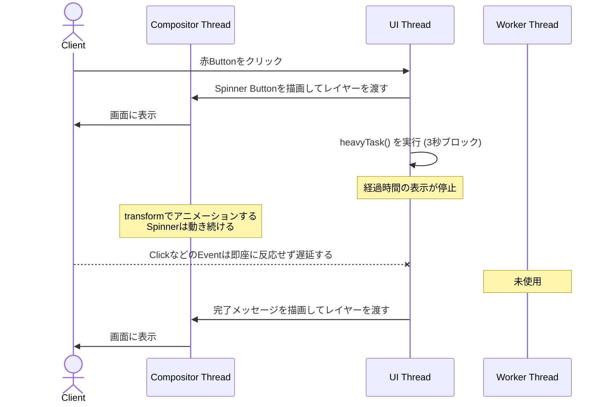
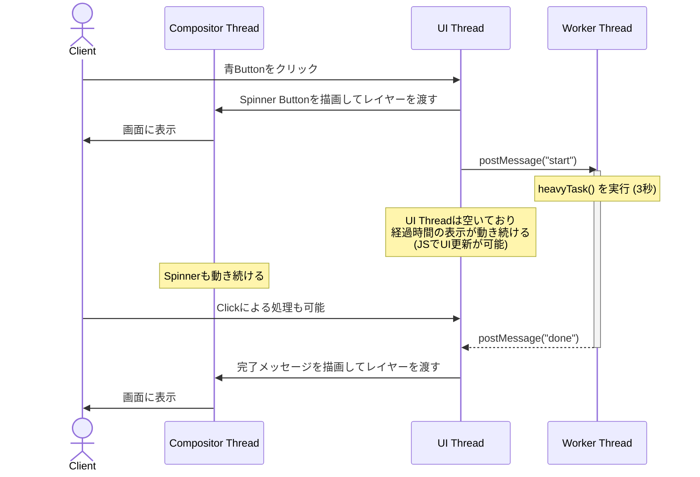

## はじめに

Webブラウザで画面が固まることはほとんどないと思います

重い処理はサーバ側で行い、Webブラウザ側は処理結果を取得するだけだからです

気まぐれで、Webブラウザ (JavaScript) で重い処理をした時の挙動を確認してみたのですが、`Compositor Thread` という重要なThreadの存在を知ったのでメモしておこうと思った次第です

:::message
`JavaScript` のことを `JS` と表記しています
:::

## 画面が固まる例

@[card](https://github.com/Flupinochan/worker-thread)

### 赤Button: UI Thread のみ

- JavaScriptで更新している処理時間の表示が止まる
- CSSアニメーションのSpinnerは動き続ける


### 青Button: UI Thread + Worker Thread

- 処理時間の表示とSpinnerの両方が動き続ける


## WebにおけるThreadの種類

| Thread                  | 利用元 | 説明                                                                  |
| ----------------------- | ------ | --------------------------------------------------------------------- |
| UI Thread (Main Thread) | JS/CSS | デフォルトのJS実行環境<br/>CSSも利用している                          |
| Worker Thread           | JS     | JSから起動可能<br/>DOM (HTML) は操作できない<br/>重い処理はここで行う |
| Compositor Thread       | CSS    | スクロール処理や一部のアニメーション用CSS                             |

:::message
`Compositor Thread` は明示的な操作が不要で、裏側で自動的に動きます
:::

以下、Service Workerなど、他にもThreadの種類はありますが、UIに関係するThreadではないため詳しくは解説しません

| Thread         | 利用元 | 説明                                                                      |
| -------------- | ------ | ------------------------------------------------------------------------- |
| Service Worker | JS     | キャッシュやオフライン対応、プッシュ通知で利用                            |
| Network Thread |        | fetch等の通信処理<br/>JSから直接操作できない                              |
| Raster Thread  |        | 画面上にピクセルとして表示するラスタライズ処理<br/>JSから直接操作できない |

## 画面が固まる仕組み

画面が固まる原因は `UI Thread` 上で画像や動画を直接処理するような、CPUを使い続ける `同期処理` です

一方、HTTP Request (fetch) のような通信処理は、別の `Network Thread` で行われる `非同期処理` であり、Responseの待機中は `UI Thread` を使用していません

`UI Thread` に負担がないため、CSSの適用などの画面更新処理に影響がなく、画面が固まらないということです

:::message
HTTP Request (fetch) は `Network Thread` で行われる!!
:::

## CSSが利用するThreadについて

:::message
CSS Propertyによって異なるThreadを使用する!!
:::

`UI Thread` を利用するCSS PropertyはJavaScriptと干渉しますが、`Compositor Thread` を利用するCSS PropertyはJavaScriptと干渉しません

つまり、重いJavaScript処理を実行した時に `Compositor Thread` を利用するCSS Propertyは影響を受けませんが、`UI Thread` を利用するCSS Propertyは影響を受けて動作しなくなり「画面が固まる」ことがあります

以下にWebブラウザが画面を描画する処理の流れと、各処理が利用するThreadを記載しました

| 処理            | CSS Property                   | 利用する Thread   | 説明                                                                                         |
| --------------- | ------------------------------ | ----------------- | -------------------------------------------------------------------------------------------- |
| 1. スタイル計算 |                                | UI Thread         | 各HTML ElementにどのCSSを適用するか計算<br/>`className` を変更した場合はここから再計算される |
| 2. レイアウト   | `top`<br/>`width`<br/>`margin` | UI Thread         | 各Elementの位置やサイズを計算                                                                |
| 3. ペイント     | `color`                        | UI Thread         | 各Elementをレイヤーに描画                                                                    |
| 4. 合成         | `transform`<br/>`opacity`      | Compositor Thread | 各レイヤーを組み合わせて1つの画面を作成<br/>JSと干渉せず画面が固まらない処理                 |

`レイヤー` は、画像編集アプリを利用したことのある方やイラストを描く方には理解しやすいかもしれません

重いJavaScriptの処理中でもButtonのSpinnerが動き続けるのは `Compositor Thread` での処理だからです

## Threadごとの処理フロー

### 赤Button: UI Thread のみ



### 青Button: UI Thread + Worker Thread



## まとめ

JavaScriptの重い処理で画面が固まる場合は、その処理を `Worker Thread` で実行させるか `Compositor Thread` で動く `transform` や `opacity` 等のCSSのみでアニメーションにすることで回避できる

## おわりに

私はデスクトップアプリを作ることもあるのですが、デスクトップアプリには `Compositor Thread` のような仕組みがないことも多く、デフォルトで全て `UI Thread` で動きます

ちょっとした処理でも画面が固まることが多かったのは、この違いなのかなぁ、と感じました

普段Webアプリを開発している方がデスクトップアプリを作ることになった場合は、本記事を参考にしていただければ幸いです

## 参考

- [最新のウェブブラウザの詳細（パート 1）](https://developer.chrome.com/blog/inside-browser-part1?hl=ja)
  - CPU、GPU、プロセス、スレッドとブラウザのアーキテクチャ
- [最新のウェブブラウザの詳細（パート 2）](https://developer.chrome.com/blog/inside-browser-part2?hl=ja)
  - ブラウザに訪れたときのナビゲーション、ネットワーク処理
- [最新のウェブブラウザの詳細（パート 3）](https://developer.chrome.com/blog/inside-browser-part3?hl=ja)
  - DOM、スタイル、レイアウト、ペイント、合成、ラスタライズ処理
- [最新のウェブブラウザの詳細（パート 4）](https://developer.chrome.com/blog/inside-browser-part4?hl=ja)
  - イベントや画面表示の最適化


## 追記・補足

以降は、上記ブログを読んで面白かった内容について書きます

### Web画面の生成を止めないための `defer`・`async`

Web画面の生成フローは以下です

1. HTMLを読み込み、Web画面を生成し始める
2. `<script>` タグがあると画面の生成を一時停止し、`<script>` タグのJavaScriptを実行する
3. JavaScriptの実行が完了したら、HTMLの読み込みを再開し、画面の生成を続ける

JavaScriptは `document.write()` でHTMLを書き換え可能なため、このような仕組みとなっています

:::message
`document.write()` を使用していないJavaScriptの場合は、`<script>` タグに `defer`・`async` 属性を設定することで、画面表示速度の向上が期待できます
JavaScriptのダウンロードと画面の生成が並行して行われ、実行は画面の生成後になるためです
:::

### スクロール処理を止めないための `passive: true`

スクロール処理は `Compositor Thread` で処理されるため、JavaScriptの処理が重くてもスクロールが固まることはありません

しかし、以下のようなスクロールに関係するEvent (EventListener) がある場合は、そのEventListener内でのJavaScriptの処理が完了するまでスクロールが動かない仕組みとなっています

| Event名      | 説明                                     |
| ------------ | ---------------------------------------- |
| `wheel`      | マウスホイールを回転した際に発火         |
| `touchstart` | 指がタッチスクリーンに触れた瞬間に発火   |
| `touchmove`  | 指がタッチスクリーン上を移動した際に発火 |

スクロールの処理フローは以下です

1. 上記Eventを `Compositor Thread` が受信
2. `UI Thread` のEventListenerがトリガーされ、`Compositor Thread` の処理は停止
3. EventListenerのJavaScriptの実行が完了した後、`Compositor Thread` の処理が再開

:::message
`passive: true` は `preventDefault()` でスクロール処理をキャンセルしないという宣言であり、これを付けると `Compositor Thread` は停止せずスクロールが動きます
スクロールが動いてほしい場合は、このオプションを指定する必要があります
:::

```typescript
document.body.addEventListener('touchstart', event => {
  // 処理
}, {passive: true});
```

マウスホイールによるスクロールをトリガーとした処理をする場合は、気を付けようと思いました
